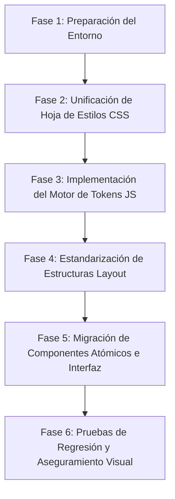

# Informe de Viabilidad: Estandarización Estructural y Tokenización de Layouts

Este informe evalúa la viabilidad técnica y operativa de implementar un sistema centralizado de tokens de diseño y estructuración visual en el proyecto **Valorizaciones**, replicando el modelo de diseño **SIATC (Crypto Blue)** implementado en **Gestor FSM**.

---

## 1. Resumen Ejecutivo

La unificación y tokenización de la interfaz en el proyecto **Valorizaciones** no solo es **totalmente viable**, sino que además es **altamente recomendada**. Ambos proyectos comparten la misma base tecnológica fundamental (React 19, Vite, y Tailwind CSS v4), lo que elimina cualquier barrera de compatibilidad de compilador o de framework. 

Al migrar a este esquema, el proyecto **Valorizaciones** logrará:
* **Consistencia visual absoluta** (mismo look & feel, tipografía, paddings, bordes, botones, y modales).
* **Mantenimiento centralizado**: Cualquier modificación estética posterior (como cambiar un radio de borde o una paleta de colores) requerirá editar únicamente un solo archivo de tokens de diseño o la configuración CSS global, en lugar de buscar y reemplazar cientos de clases utilitarias en el código JSX.

---

## 2. Análisis del Sistema de Tokenización en "Gestor FSM"

El sistema de diseño visual en **Gestor FSM** opera bajo un esquema híbrido muy eficiente diseñado para Tailwind CSS v4, que divide las decisiones en tres capas:

### Capa 1: Tokens de Diseño Atómicos (Variables CSS)
Ubicados en [index.css](file:///d:/diego/Documentos/Antigravity/Gestor%20FSM/Gestor-de-Tickets-FSM/src/index.css#L83-L156), definen los valores base en variables nativas CSS `:root` y `.dark` (colores principales, colores de fondo, bordes, etc.):
```css
:root {
  --background: #F9FAFB;
  --foreground: #050F1A;
  --primary: #4C5F80;
  --border: #D1D5DB;
  --radius: 12px;
  --cb-border: #E2E4E9;
  /* ... */
}
```

### Capa 2: Extensiones del Compilador Tailwind (`@theme`)
Se configuran en el mismo [index.css](file:///d:/diego/Documentos/Antigravity/Gestor%20FSM/Gestor-de-Tickets-FSM/src/index.css#L9-L70) usando la directiva `@theme` de Tailwind CSS v4. Esto expone las variables CSS en clases de Tailwind (como `bg-primary`, `rounded-cb-card`, `shadow-cb-level-1`):
```css
@theme {
  --color-primary: var(--primary);
  --color-border: var(--border);
  --radius-cb-card: 12px;
  --shadow-cb-level-1: 0 1px 3px rgba(5,15,26,0.06);
  /* ... */
}
```

### Capa 3: Tokens de Estructura y Comportamiento en JS/TS
En [siatc-theme.ts](file:///d:/diego/Documentos/Antigravity/Gestor%20FSM/Gestor-de-Tickets-FSM/src/utils/siatc-theme.ts) y [design-tokens.ts](file:///d:/diego/Documentos/Antigravity/Gestor%20FSM/Gestor-de-Tickets-FSM/src/utils/design-tokens.ts), las clases complejas de Tailwind se agrupan en objetos exportables de TypeScript (`SIATC_THEME`):
```typescript
export const SIATC_THEME = {
  LAYOUT: {
    PAGE_WRAPPER: "flex flex-col h-full bg-cb-bg min-h-0 pt-4 px-4 pb-1.5 space-y-4",
    PAGE_CONTAINER: "w-full flex-1 flex flex-col min-h-0 gap-6 max-w-7xl mx-auto",
  },
  COMPONENTS: {
    BUTTON_PRIMARY: "h-[36px] px-4 inline-flex items-center justify-center gap-2 bg-primary text-primary-foreground rounded-cb-btn hover:bg-primary/90 transition-all font-bold text-sm",
    INPUT: "h-[36px] w-full px-4 bg-white border border-cb-border rounded-cb-btn focus:border-primary ...",
  }
}
```
Esto permite que los componentes de React consuman las clases de forma semántica:
```tsx
<div className={SIATC_THEME.LAYOUT.PAGE_WRAPPER}>
  <button className={SIATC_THEME.COMPONENTS.BUTTON_PRIMARY}>
    Guardar
  </button>
</div>
```

---

## 3. Estado Actual del Proyecto "Valorizaciones"

Actualmente, **Valorizaciones** cuenta con las bases del tema cargadas en su propio [index.css](file:///d:/diego/Documentos/Antigravity/Valorizaciones/valorizaciones/src/index.css#L60-L127), pero su adopción en las páginas es inconsistente y descentralizada:
1. **Clases Hardcoded (Código Quemado):** Páginas críticas y complejas como [ValuationsPage.tsx](file:///d:/diego/Documentos/Antigravity/Valorizaciones/valorizaciones/src/pages/ValuationsPage.tsx) (de gran tamaño, >200 KB) y [DashboardPage.tsx](file:///d:/diego/Documentos/Antigravity/Valorizaciones/valorizaciones/src/pages/DashboardPage.tsx) definen de forma explícita las clases de espaciado, curvaturas de bordes y colores en su JSX (ej. `rounded-xl border border-border p-6 shadow-sm hover:border-primary/20`).
2. **Layout y Cabecera Rígidos:** Los envolventes principales de página no usan un estándar. Por ejemplo, en [MainLayout.tsx](file:///d:/diego/Documentos/Antigravity/Valorizaciones/valorizaciones/src/components/layout/MainLayout.tsx#L63-L132) de Valorizaciones se tienen paddings fijos de cabecera (`px-4 py-2 min-h-[56px]`) en comparación con el esquema fluido de `MainLayout.tsx` de Gestor FSM (altura estandarizada `h-20` con estilo *SIATC Platinum* y efectos de *Glassmorphism*).

---

## 4. Viabilidad de Replicación del Sistema Visual

La viabilidad técnica es del **100%**. Ambos proyectos:
* Ejecutan **Tailwind CSS v4** compilado a través de `@tailwindcss/vite`.
* Usan **React Router v7/DOM** para el enrutamiento.
* Comparten la misma estructura de directorios (`src/components/layout`, `src/pages`, `src/utils`).

### Comparación Directa de la Estructura de Diseño

| Aspecto de UI/UX | Valorizaciones (Actual) | Gestor FSM (Estandarizado) | Esfuerzo de Adaptación |
| :--- | :--- | :--- | :--- |
| **Paddings de Página** | Variables (`p-1`, `p-2`, `p-6`) | Estandarizado (`PAGE_WRAPPER`) | Bajo (Reemplazo en contenedor raíz) |
| **Botones** | Gradientes ad-hoc, alturas variables | Estandarizado a `h-[36px]`, `rounded-cb-btn` | Medio (Reemplazo de clases por variable de token) |
| **Campos de Texto** | Estilos manuales en JSX | Estandarizado a `h-[36px]`, `rounded-cb-btn` | Medio (Reemplazo de clases por variable de token) |
| **Cabecera (Header)** | `min-h-[56px]`, diseño plano | `h-20`, *SIATC Premium* Glassmorphic | Medio (Sustitución de componentes en `MainLayout.tsx`) |
| **Curvatura (Radius)** | `rounded-xl` / `rounded-lg` genéricos | Tokens semánticos (`chip: 4px`, `btn: 8px`, `card: 12px`, `modal: 16px`) | Alto (Requiere mapeo minucioso de cada contenedor) |
| **Tablas** | Estilo básico Tailwind | Estructura de filas estándar de `64px`, sticky, scroll fluido | Alto (Requiere refactorizar la visualización de datos en `ValuationsPage`) |

---

## 5. Plan de Acción Recomendado (Hoja de Ruta)

Para llevar a cabo la unificación estética sin romper la lógica funcional del proyecto, se sugiere seguir estos pasos estructurados:



### Detalle de las Fases

1. **Fase 1: Preparación del Entorno**
   * Respaldar el estado actual del repositorio `Valorizaciones`.
   * Copiar o crear el archivo de utilitarios de combinación de clases `src/utils/cn.ts` (si difiere) para admitir la inyección de tokens combinada.

2. **Fase 2: Unificación de Hoja de Estilos CSS**
   * Actualizar el archivo [index.css](file:///d:/diego/Documentos/Antigravity/Valorizaciones/valorizaciones/src/index.css) de Valorizaciones para incluir los tokens de diseño extendidos de SIATC en la sección `@theme` y definir las variables CSS para los modos claro/oscuro de manera exacta a como están en Gestor FSM (añadiendo variables como `--cb-bg`, `--cb-border`, sombras `shadow-cb-*`, etc.).

3. **Fase 3: Implementación del Motor de Tokens JS**
   * Crear el archivo `src/utils/siatc-theme.ts` en el proyecto **Valorizaciones** e importar el objeto `SIATC_THEME`.

4. **Fase 4: Estandarización de Estructuras Layout**
   * Actualizar [MainLayout.tsx](file:///d:/diego/Documentos/Antigravity/Valorizaciones/valorizaciones/src/components/layout/MainLayout.tsx), [Sidebar.tsx](file:///d:/diego/Documentos/Antigravity/Valorizaciones/valorizaciones/src/components/layout/Sidebar.tsx) y [AppSwitcher.tsx](file:///d:/diego/Documentos/Antigravity/Valorizaciones/valorizaciones/src/components/layout/AppSwitcher.tsx) de Valorizaciones para alinearlos con el diseño estructural premium de Gestor FSM (incluyendo la cabecera estilizada de `h-20` con Glassmorphic y el menú lateral unificado).

5. **Fase 5: Migración de Componentes Atómicos e Interfaz**
   * Reemplazar las clases manuales en los formularios, modales, tablas y botones de las páginas `DashboardPage`, `ValuationsPage`, `TarifarioPage`, `MaterialsPage` y `PenaltiesPage` por las propiedades estandarizadas de `SIATC_THEME.COMPONENTS.*`, `SIATC_THEME.TYPOGRAPHY.*`, y `SIATC_THEME.TABLE.*`.

6. **Fase 6: Pruebas de Regresión y Aseguramiento Visual**
   * Verificar la visualización correcta de los gráficos de Recharts en el Dashboard.
   * Probar el responsive design en dispositivos móviles e interactividad de los modales en la página de valorizaciones.

---

## 6. Riesgos y Mitigación

* **Riesgo 1: Regresión visual en formularios y modales complejos.**
  * *Mitigación:* Realizar la refactorización pantalla por pantalla, validando el responsive y los estados de validación en cada paso en lugar de hacer un "buscar y reemplazar" global ciego.
* **Riesgo 2: Pérdida de interactividad en los gráficos de Recharts.**
  * *Mitigación:* Mantener la lógica interna de `recharts` intacta y modificar únicamente las clases del contenedor exterior y la tipografía de los tooltips mediante clases tokenizadas.
* **Riesgo 3: Desalineación tipográfica.**
  * *Mitigación:* Asegurar que la fuente `DM Sans` y `JetBrains Mono` estén correctamente enlazadas en el archivo HTML principal de Valorizaciones para que coincidan con la apariencia de Gestor FSM.

---

## 7. Conclusión

La implementación de este esquema de tokenización dotará al sistema de **Valorizaciones** de una interfaz de nivel premium idéntica a la de **Gestor FSM**, simplificando drásticamente el desarrollo y la evolución visual futura del ecosistema de aplicaciones de GAC Sole. El proceso es directo y técnicamente limpio gracias a la paridad tecnológica de ambos proyectos.
